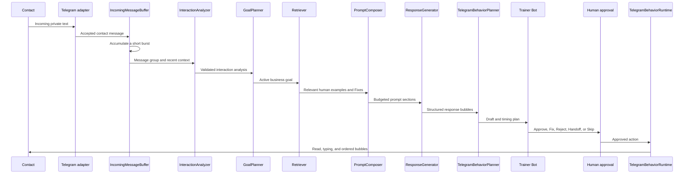

# AA.1 Telegram Human Agent MVP

## Purpose

AA.1 provides a working, approval-first vertical flow for handling inbound
Telegram sales conversations. It understands a short message burst, chooses a
business goal, prepares a style-aware response and realistic Telegram timing,
and asks a private trainer for a decision before sending anything.

The repository's current release remains AA.2 because the incremental style
compiler builds on this AA.1 runtime capability.

## Message flow



Each contact has an independent accumulation and runtime task. A newer incoming
message invalidates an older pending draft. Urgent bypass is configurable but
disabled by default.

## Module boundaries

- `domain`: identity, business, style, relationship, state, analysis, goal,
  response, behavior, prompt, and provenance models.
- `agent.analyzer`: structured conversation understanding with a safe fallback.
- `agent.goal_planner`: chooses the next business action, not reply wording.
- `agent.retriever`: selects a small relevant set of real human evidence, with
  Trainer Fix corrections first.
- `agent.prompt_composer`: assembles separately budgeted safety, business,
  identity, style, goal, relationship, state, analysis, evidence, and recent
  context sections.
- `agent.response_generator`: returns a validated reply decision and bounded
  Telegram bubbles.
- `telegram.buffer`: per-contact message accumulation.
- `telegram.orchestrator`: persists incoming messages and creates drafts.
- `telegram.behavior`: plans and executes Telegram-native delays and delivery.
- `telegram.approval`: consumes idempotent Trainer Bot actions.
- `llm.conversation_client`: replaceable structured provider; production uses
  the OpenAI Responses API and simulation uses a deterministic fake.
- `storage.sqlite_repository`: backward-compatible local persistence.

The analyzer and response generator use separate prompts and schemas. Analyzer
output contains no proposed reply wording.

## Shadow mode

Shadow or approval mode is the only supported production mode for this MVP.
The agent never sends a model draft automatically. It first persists the draft
and behavior plan, then sends a private review card. Startup fails closed when
SQLite feedback, Trainer Bot, or shadow mode is unavailable.

Before every approved bubble, the runtime checks that:

1. the draft is still pending or approved and is not stale;
2. no newer incoming message has superseded it;
3. the account owner has not replied manually after the triggering message.

Any failed check stops the remaining delivery.

## Trainer Bot workflow

The card shows the incoming message group, detected intent and stage, active
goal, proposed bubbles, timing plan, confidence, handoff decision, model, and
prompt version.

- `Approve`: send the proposed bubbles.
- `Fix`: send trainer-authored replacement text and store `human_fix`
  provenance.
- `Reject`: record negative feedback and send nothing.
- `Handoff`: send nothing and disable agent processing for this contact.
- `Skip`: close the draft and send nothing.
- `Details`: show safe metadata, not the complete prompt or private history.

Actions use persistent idempotency keys, so a repeated callback does not create
another send.

## Telegram behavior runtime

The behavior planner calculates bounded read, pre-typing, typing, and
inter-bubble delays. Timing varies with message length, urgency, time of day,
configured typing speed, and jitter. The asynchronous runtime marks messages
read, shows typing, sends bubbles in order, and stores exact timestamps and
Telegram message IDs.

An interruption stops unsent bubbles without blocking work for other contacts.

## Data and provenance

SQLite schema version 3 retains historical feedback tables and adds:

- `identities`, `business_profiles`, `style_profiles`;
- `relationship_profiles`, `conversations`, `conversation_states`, `messages`;
- `behavior_plans`, `drafts`, `feedback`, `retrieved_examples`;
- `runtime_events`, `handoffs`, `trainer_actions`.

Messages and examples keep provenance such as `contact`, `human_user`,
`ai_draft`, `ai_sent`, `human_fix`, `human_approved`,
`imported_human_history`, and `system_generated`. Approved AI output is still
AI output: it is not promoted to human style evidence. Rejected drafts are
never positive examples.

Structured runtime events include correlation IDs without logging complete
private message text.

## Configuration

Copy `.env.example` to `.env`. Secrets stay only in `.env` and local session
storage. Important non-secret controls include:

```dotenv
SHADOW_MODE=true
ACCUMULATION_MIN_WAIT_SECONDS=3
ACCUMULATION_MAX_WAIT_SECONDS=12
URGENT_MESSAGE_BYPASS=false
ALLOWED_TELEGRAM_USER_IDS=1751105897
MAX_BUBBLE_COUNT=4
MAX_MESSAGE_LENGTH=1200
CONFIDENCE_THRESHOLD=0.55
HANDOFF_THRESHOLD=0.25
PROMPT_TOKEN_BUDGET=6000
IDENTITY_PROFILE_PATH=config/identity.example.json
BUSINESS_PROFILE_PATH=config/business.example.json
STYLE_PROFILE_PATH=config/style.example.json
```

Blank `ANALYSIS_MODEL` and `RESPONSE_MODEL` values fall back to
`OPENAI_MODEL`. The editable JSON examples under `config/` contain no secrets.

## Run and inspect

Create the Telethon session once:

```bat
scripts\login_telegram.bat
```

Run the private Trainer Bot and the agent in separate terminals:

```bat
scripts\start_trainer_bot.bat
scripts\start_agent.bat
```

The equivalent direct agent command is:

```bat
uv run python -m conversation_agent run --shadow
```

Run a credential-free deterministic simulation:

```bat
uv run python -m conversation_agent simulate --contact-id test-contact --message "Hello, I need a Telegram sales bot"
```

The simulation prints analyzer output, active goal, retrieved example IDs,
generated response, bubble split, timing, handoff decision, and safe prompt
inspection.

Inspect local private state:

```bat
uv run python -m conversation_agent inspect-conversation 1751105897
uv run python -m conversation_agent inspect-draft 1
```

## Validation

The MVP is covered by unit and local integration tests with fake Telegram and
LLM providers. No test connects to a real account or API.

```bat
uv run ruff check .
uv run pyright
uv run pytest -q
uv run python -m compileall -q src tests
```

## Known limitations

- The first business flow is inbound sales qualification only.
- Profiles are editable JSON or Markdown; there is no profile-management UI.
- Relationship learning is deliberately neutral and conservative.
- Handoff resolution is stored but has no dedicated Trainer Bot resume button.
- Telegram and SQLite cannot provide one distributed transaction after the
  Telegram API accepts a bubble.
- Simulation validates orchestration components but does not emulate Telethon
  network behavior.

## Outside AA.1

Cold outreach, user discovery, anti-spam bypass, CRM, billing, dashboards,
other social networks, voice cloning, fine-tuning, and multi-tenant SaaS are
intentionally not implemented.
