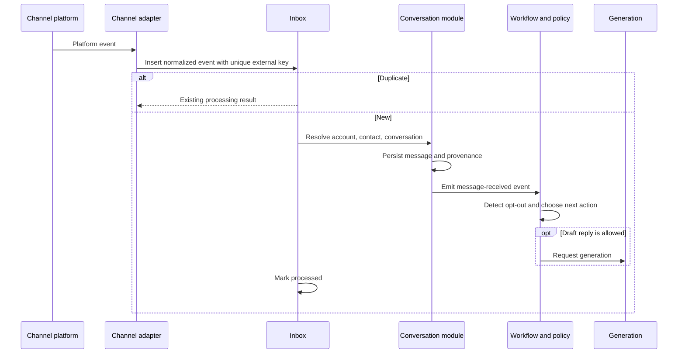
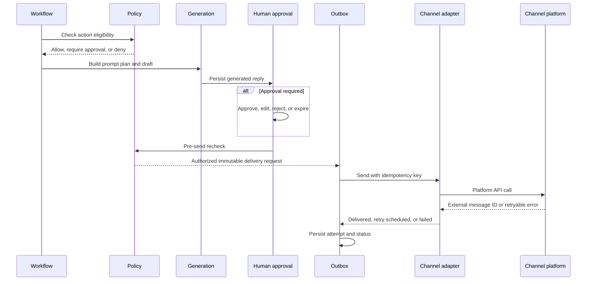

# Channel Connectors

## Contract

Core modules use a channel-neutral `MessageEnvelope`. It contains workspace,
connector account, external conversation/message IDs, direction, sender and
recipient identities, timestamps, text/media references, reply/thread
references, and normalized delivery metadata. Telegram entities remain in the
Telegram adapter.

Each connector implements receive normalization, send, capability discovery,
delivery-status handling, and identity/account mapping. Capability flags cover
editing, deletion, reactions, threads, attachments, maximum size, rate limits,
and explicit opt-out signals.

## Inbound flow

The inbox is committed before processing. Redelivery is normal and handlers are
idempotent.

## Outbound flow

## Idempotency and ordering

Inbound uniqueness is `(connector_account_id, external_event_id)` or a stable
platform-derived equivalent. Outbound uniqueness is a server-generated
delivery key bound to one approved content version. A retry cannot create a new
logical message. Per-conversation sequence numbers protect ordering where the
platform cannot.

Unknown send outcomes are reconciled by platform lookup when available and are
never blindly retried as a new message. Connector credentials are secret-store
references, not domain fields or logs.

## Migration

The existing Telethon agent becomes the first legacy adapter. The existing
Telegram Bot API trainer remains a separate feedback ingress until its actions
can use the same authenticated command and audit contracts.
