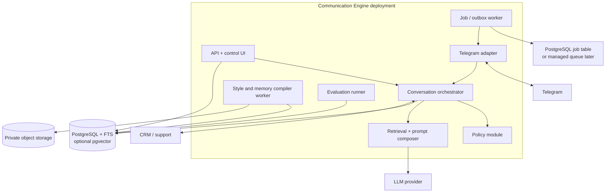

# Container Design

The deployable starts as one API/worker codebase with clear modules. Separate
processes are operational containers, not microservices.

## Modules

- `tenancy`: workspaces, membership, roles, RLS context;
- `identities`: company/operator identities and style versions;
- `contacts`: contacts, consent, do-not-contact;
- `conversations`: normalized messages and provenance;
- `workflows`: sales/support state and timers;
- `policy`: channel/compliance/claim/send decisions;
- `generation`: retrieval, prompt plans, model calls, drafts;
- `approval`: review and escalation;
- `feedback`: corrections and evaluations;
- `delivery`: channel ports, inbox/outbox, attempts;
- `audit`: append-only domain and security events.

Python packages may remain in one repository and transaction boundary. Module
ports prevent provider/channel/storage code from entering domain transitions.
