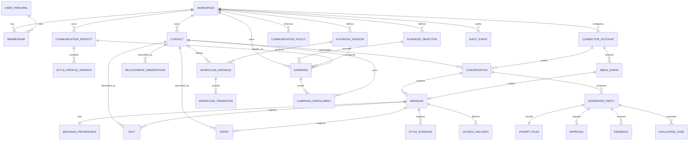

# Core Domain Model

## Aggregate boundaries

- **Conversation:** messages and channel thread identity; it never owns facts or
  style rules.
- **Generation:** prompt plan, generated reply, model metadata, safety result,
  and approval; immutable after delivery except review state.
- **Identity/style:** editable identity plus immutable compiled versions.
- **Memory:** facts/events/relationship observations with source links and
  validity.
- **Workflow:** explicit state and transitions; no state is inferred only from
  an LLM message.
- **Delivery:** inbox/outbox attempts and external IDs.

## Provenance enums

`origin`: `contact`, `human_operator`, `ai_generated`, `imported`,
`system_generated`.

`evidence_eligibility`: `human_style_positive`, `human_fix_positive`,
`negative`, `context_only`, `evaluation_only`, `ineligible`.

`approval_mode`: `draft_only`, `approval_required`, `auto_send_allowlisted`,
`human_only`.

## Temporal fields

Facts and relationship observations use `observed_at`, `valid_from`,
`valid_until`, `recorded_at`, `supersedes_id`, `confidence`, and
`source_message_id`. This borrows Graphiti's temporal semantics without making a
graph database mandatory.
