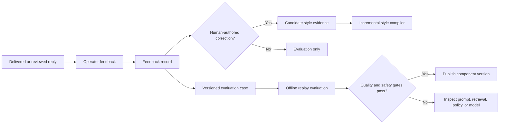

# Feedback and Evaluation

## Feedback contract

Feedback belongs to the generated reply and its prompt plan, not only to the
conversation. The first vocabulary remains compatible with AA.2:

- `good`: acceptable without a material change;
- `bad`: should not be sent in this form;
- `fix`: human supplied a better text;
- `should_not_reply`: the correct action was silence.

Optional structured reasons can be added without changing those labels:
incorrect fact, wrong tone, policy violation, excessive length, missed goal,
bad timing, or retrieval failure. Free-text notes and the operator's replacement
remain private tenant data.

## Learning loop

Only explicit human corrections can become style evidence. Ratings on an AI
reply describe output quality but do not make that output human-authored.
Memory corrections supersede the referenced observation; they do not silently
rewrite message history.

## Evaluation layers

1. Deterministic tests: tenant isolation, provenance, policy, prompt budgets,
   idempotency, and state-transition invariants.
2. Retrieval tests: expected evidence, recall, precision, source diversity, and
   forbidden-evidence exclusion.
3. Generation replay: fixed prompt plans and a versioned evaluation set,
   scored for action choice, factuality, tone, goal progress, and policy.
4. Shadow evaluation: generate without sending and compare with operator
   action.
5. Production outcomes: approval rate, edit distance, silence accuracy,
   opt-out, escalation, duplicate-send rate, and business-stage progression.

Model-based judges may supplement rubrics but never replace deterministic
safety gates or human sampling. Store the judge model, rubric version, inputs,
and score so the result can be reproduced and challenged.

## Release gates

A prompt, retriever, compiler, or model change starts in replay, then shadow,
then a restricted workspace allow-list. Regression in cross-tenant isolation,
provenance, opt-out handling, or duplicate sends blocks release regardless of
aggregate quality. Auto-send requires a stricter per-use-case threshold than
draft generation.
