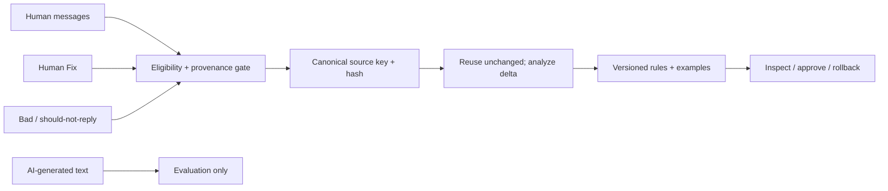
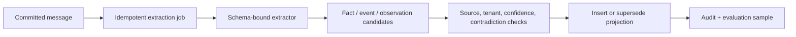

# Memory and Style

## Separation

| Type | Question answered | Update mechanism | Runtime priority |
| --- | --- | --- | --- |
| Identity | Who is speaking and with what authority? | Human edit/version | Always-on |
| Style | How does this identity express itself? | Evidence compiler + review | Always-on rules + retrieved examples |
| Factual memory | What is true about contact/company? | Source-linked extraction/correction | Query relevant |
| Episodic memory | What happened? | Event extraction | Query relevant |
| Relationship memory | How has the relationship changed? | Observation + temporal projection | Query/stage relevant |
| Workflow state | What should happen next? | Deterministic transition | Always-on for action |
| Conversation state | What is happening now? | Message/session | Recent window |

## Style compilation

Preserve AA.2 invariants: unchanged evidence makes zero analysis requests;
fingerprint changes need explicit rebuild; deletion removes contributions; Fix
outranks ordinary examples; AI output is never positive human evidence.

## Memory extraction

Extraction is asynchronous and cannot block delivery. Low-confidence or
sensitive candidates require review. Corrections create a superseding record;
they do not silently rewrite source history.

## No fine-tuning in v1

Weights blur facts/style, complicate deletion, slow feedback, and prevent
per-contact selection. Reviewed provider-independent datasets remain valuable
for later open-weight experiments under a separate ADR.
