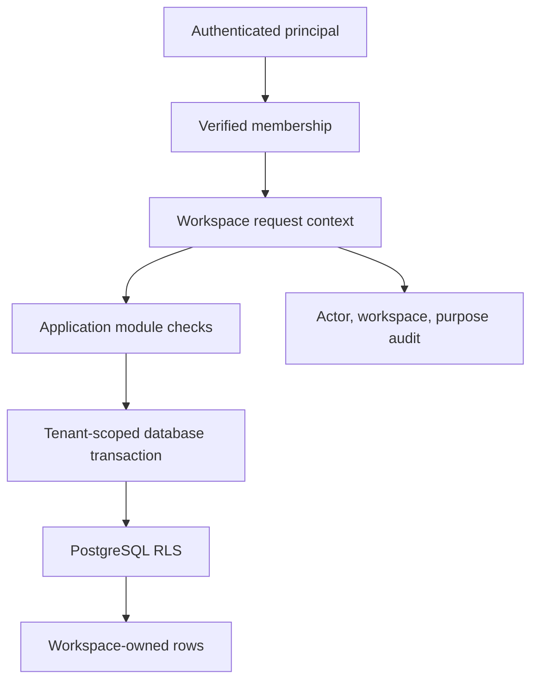

# Multi-Tenancy

## Boundary

`Workspace` is the tenant. Every private business row carries `workspace_id`
directly, including children whose parent already has it. The duplication is an
intentional defense and makes row-level policies, indexes, background jobs, and
audits explicit.

`Membership` binds a principal to a workspace and role. An operator may belong
to several workspaces, but every request and background job selects exactly one
workspace context. User-supplied `workspace_id`, `contact_id`, or external
channel identifiers are never authorization.

## Enforcement

- PostgreSQL row-level security is enabled on tenant tables.
- Application transactions set a database session tenant from a verified
  membership; connection-pool cleanup is tested.
- Foreign keys include `workspace_id` where practical, preventing a child from
  referencing another tenant's parent.
- Object storage paths, cache keys, vector metadata, queues, logs, metrics, and
  idempotency keys include the workspace boundary.
- Workers receive an opaque job ID, load its workspace under a service
  principal, and execute in a fresh tenant-scoped transaction.
- Cross-workspace administration uses a separate audited role, not an RLS
  bypass in normal application code.

## Isolation tests

For each repository and endpoint, create same-shaped records in two workspaces
and prove that reads, updates, deletes, search, exports, prompt retrieval, jobs,
and audit views cannot cross the boundary. Test guessed UUIDs, stale pooled
connections, malformed job payloads, and privileged support access.

## Deployment options

The default is a shared database and schema with RLS. Larger or regulated
customers may later receive a database-per-workspace placement behind the same
repository contract. Encryption keys, retention, export, and deletion policies
can then vary by placement without changing domain ownership.

Logical namespaces such as Mem0 `user_id`, Graphiti `group_id`, or a vector
metadata filter can improve retrieval, but they are not a security boundary.
