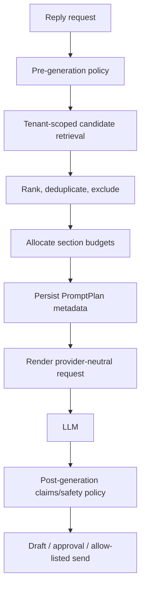

# Retrieval and Prompting

## Candidate sources

Always-on: identity, approved company claims, communication policy, workflow
state, channel constraints, compiled style rules.

Retrieved: human/Fix style examples, contact facts, relevant episodes,
relationship observations, approved knowledge, and selected recent history.

## Ranking

Initial implementation uses PostgreSQL FTS plus deterministic boosts:

```text
score =
  lexical_relevance
  + evidence_priority
  + contact_scope
  + workflow_scope
  + recency_decay
  + confidence
  - contradiction_penalty
  - duplication_penalty
  - privacy/risk exclusion
```

Fix corrections receive the highest style priority. Mandatory policy/workflow
facts bypass retrieval ranking. Vector similarity becomes a candidate signal
only after an evaluation shows recall gain. Reranking must be tenant-filtered
before candidates leave storage.

## Prompt plan



Order:

1. product safety and truthfulness;
2. communication identity and authority;
3. company policy and approved claims;
4. workflow objective/state and allowed action;
5. manual overrides and compiled style rules;
6. contact/relationship context;
7. retrieved Fix and human examples;
8. recent conversation;
9. output contract.

## PromptPlan record

Store composer version, prompt version, identity/style version IDs, policy
decision, workflow version, selected evidence IDs/types/scores, exclusions,
section character/token budgets, model/provider/settings, and rendered-content
hash. Private rendered text may follow shorter retention than metadata.

Prompt injection defenses treat contact messages, memories, imports, and
retrieved documents as quoted untrusted data, never higher-priority
instructions.
