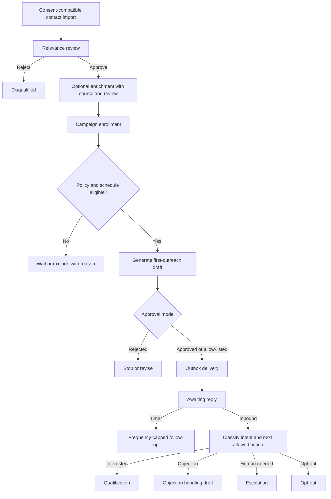
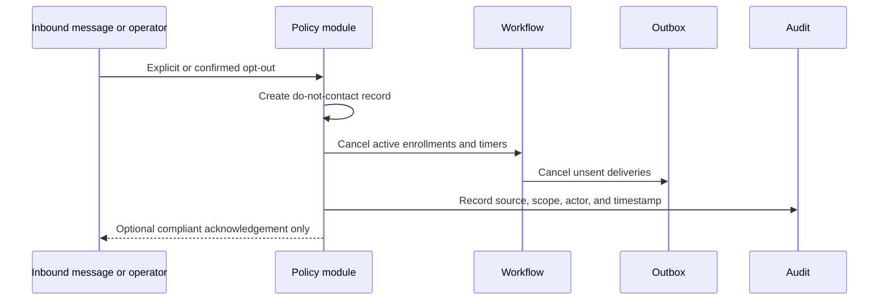
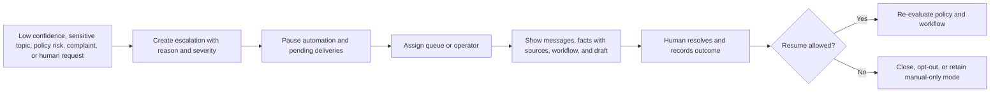

# Sales and Support Workflows

## Deterministic state, assisted text

Workflow state and allowed transitions are deterministic. The model may
classify a reply, extract a candidate fact, or draft text, but it cannot invent
a state transition outside the playbook. Each transition records previous and
next state, trigger, actor, policy decision, timestamp, and related message.

The initial sales stages are `discovered`, `imported`, `relevance_review`,
`enrichment_review`, `ready`, `first_outreach`, `awaiting_reply`, `follow_up`,
`qualification`, `objection`, `proposal`, `meeting`, `won`, `lost`,
`disqualified`, `opted_out`, and `escalated`. A support playbook can use a
separate state set behind the same transition contract. Contact discovery and
enrichment are external/manual inputs in v1: the engine records their source
and review status but does not scrape or autonomously source leads.

## Campaign and reply flow

Campaigns define objective, identity, audience snapshot, playbook version,
approval mode, schedule, channel, frequency cap, and policy version. Enrollment
is independently pausable and records why a contact entered or left.

## Opt-out flow

Opt-out is synchronous and takes precedence over campaign state, model output,
and operator defaults. Re-entry requires a new auditable lawful basis or
explicit consent according to the workspace policy.

## Escalation flow

## Timers

Database-backed jobs are sufficient for v1. A job claims a due transition with
`SKIP LOCKED`, checks the current workflow version and policy, and writes the
next job in the same transaction. Temporal becomes relevant only when measured
volume, long-running compensation, or operational visibility exceeds this
model.
