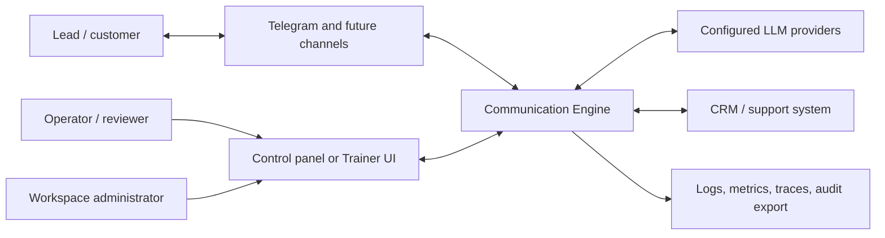

# System Context

## Trust boundaries

- Channel payloads and contact text are untrusted.
- LLM output is untrusted until policy and approval permit delivery.
- Provider calls receive only tenant-scoped, budgeted context.
- CRM data is authoritative only for fields declared in the integration
  contract.
- Operators may see only workspaces granted by membership.
- Audit data is write-only to normal workflows and redacted in operational logs.

## External responsibilities

Channels own platform authentication, external IDs, limits, and delivery
receipts. LLM providers own inference only. CRM/support systems may own canonical
lead/customer records. The Communication Engine owns orchestration, voice,
memory projections, workflow, approvals, and delivery intent.
