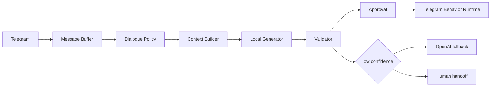

# Local Telegram SLM Experiment

This branch is an experimental proof of concept, not a production replacement
for the current OpenAI runtime.

## Goal

The experiment checks whether Telegram response generation can move from large
dynamic style prompts and repeated OpenAI calls to a compact local model path:



## Architecture

The proof of concept separates the system into small components:

- `DialoguePolicy`: chooses `reply`, `no_reply`, `wait`, `reaction`, or `handoff`.
- `LocalContextBuilder`: builds a short structured context instead of sending a
  full style bundle or long prompt.
- `LocalGenerationProvider`: supports fake offline generation and
  OpenAI-compatible local HTTP endpoints such as llama.cpp server or vLLM.
- `OutputValidator`: blocks invalid JSON shape, empty replies, duplicate
  bubbles, overly long bubbles, links, forbidden assistant phrases, stale drafts,
  takeover, pause, and missing approval.
- `HybridGenerationRouter`: supports `local_only`, `local_with_fallback`,
  `openai_only`, and `compare_shadow`.
- `AgentAdapterRegistry`: records active LoRA adapter metadata per agent.
- Dataset, training dry-run, and benchmark utilities live under
  `conversation_agent.local_slm`.

## Local Endpoint

Run a llama.cpp-compatible server separately, for example:

```powershell
llama-server -m C:\models\telegram-qwen.gguf --host 127.0.0.1 --port 8080
```

Then configure:

```env
GENERATION_MODE=local_only
LOCAL_GENERATION_PROVIDER=openai_compatible
LOCAL_GENERATION_BASE_URL=http://127.0.0.1:8080/v1
LOCAL_GENERATION_MODEL=telegram-qwen3-0.6b
```

No model is downloaded automatically by this repository.

## Offline Demo

The fake provider requires no OpenAI, Telegram, GPU, torch, or transformers:

```powershell
python -m conversation_agent local-simulate `
  --contact-id test-contact `
  --agent-id informal-manager `
  --message "привет" `
  --message "нужен бот для заявок"
```

The output includes accumulated messages, policy decision, compact context,
selected provider, generated bubbles, validation, fallback route, and behavior
metadata.

## Dataset

Build an SFT-style dataset from the reviewed local export:

```powershell
python -m conversation_agent build-slm-dataset `
  --source .runtime/exports/cleaned_examples.jsonl `
  --output .runtime/training/datasets/local-sft.jsonl
```

Rules:

- AI-generated messages are excluded from human targets.
- Duplicates are removed by deterministic fingerprint.
- Train/test split is deterministic by conversation ID.
- Private datasets stay under `.runtime/` and are ignored by Git.

## Training Dry-Run

Dry-run planning validates the dataset and estimates batches without loading a
model:

```powershell
python -m conversation_agent local-train-dry-run `
  --dataset .runtime/training/datasets/local-sft.jsonl `
  --base-model Qwen2.5-0.5B `
  --output-dir .runtime/models/adapters/informal-manager
```

Real LoRA/QLoRA training remains explicit and experimental. VRAM requirements
depend on the selected backend, quantization, sequence length, and model config;
the dry-run intentionally reports only planning estimates.

## Benchmark

Run the reproducible fake/local benchmark:

```powershell
python -m conversation_agent benchmark run `
  --dataset tests/fixtures/dialogue_benchmark.jsonl `
  --providers fake `
  --output .runtime/benchmarks/run-001
```

The benchmark writes raw outputs and summary metrics, including validity,
no-reply accuracy, output length, and provider failure rate. Blind comparison
can be layered on top of the saved candidate outputs without revealing provider
names before the operator decision.

## Fallback

OpenAI remains available as fallback, benchmark, and teacher. The production
default is still:

```env
GENERATION_MODE=openai_only
```

The experiment does not remove the OpenAI provider and does not switch the
production flow to local generation by default.

## Limits

- The fake provider is only for tests and demos.
- The OpenAI-compatible provider expects a running local server.
- In-process Hugging Face support is intentionally not imported by the base
  runtime; it belongs in an optional `training` or `local-inference` extra.
- No weights, adapters, private exports, or datasets should be committed.
