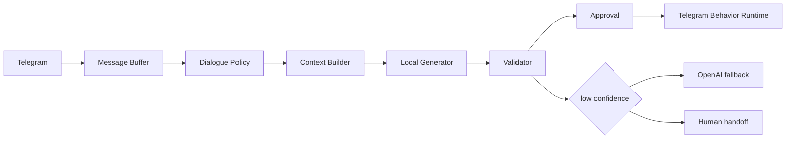

# Local Telegram SLM Experiment

This branch is an experimental proof of concept, not a production replacement
for the current OpenAI runtime.

## Goal

The experiment checks whether Telegram response generation can move from large
dynamic style prompts and repeated OpenAI calls to a compact local model path:



## Architecture

The proof of concept separates the system into small components:

- `DialoguePolicy`: chooses `reply`, `no_reply`, `wait`, `reaction`, or `handoff`.
- `LocalContextBuilder`: builds a short structured context instead of sending a
  full style bundle or long prompt.
- `LocalGenerationProvider`: supports fake offline generation and
  OpenAI-compatible local HTTP endpoints such as llama.cpp server or vLLM.
- `OutputValidator`: blocks invalid JSON shape, empty replies, duplicate
  bubbles, overly long bubbles, links, forbidden assistant phrases, stale drafts,
  takeover, pause, and missing approval.
- `HybridGenerationRouter`: supports `local_only`, `local_with_fallback`,
  `openai_only`, and `compare_shadow`.
- `AgentAdapterRegistry`: records active LoRA adapter metadata per agent.
- Dataset, training dry-run, and benchmark utilities live under
  `conversation_agent.local_slm`.

## Local Endpoint

Stage 1 uses the official llama.cpp HTTP server with
`Qwen/Qwen3-0.6B-GGUF:Q8_0`. Install and run it on localhost:

```powershell
scripts\local_slm\install_llama_cpp.bat
scripts\local_slm\start_qwen3_06b.bat
scripts\local_slm\check_qwen3_06b.bat
```

The start script binds only to `127.0.0.1:8080`, limits context to 4096
tokens, writes its PID and logs under `.runtime/local_slm/`, waits for
`/health` and `/v1/models`, and refuses to start a second server. Stop only
the managed process with:

```powershell
scripts\local_slm\stop_qwen3_06b.bat
```

Configuration:

```env
GENERATION_MODE=local_only
LOCAL_LLM_BASE_URL=http://127.0.0.1:8080/v1
LOCAL_LLM_MODEL=Qwen/Qwen3-0.6B-GGUF:Q8_0
LOCAL_LLM_API_KEY=local-no-key
LOCAL_LLM_TIMEOUT_SECONDS=30
LOCAL_LLM_MAX_OUTPUT_TOKENS=256
LOCAL_LLM_CONTEXT_TOKENS=4096
LOCAL_LLM_THINKING=false
```

The model is downloaded by llama.cpp into the user Hugging Face cache. It is
not stored in the repository. The normal project default remains
`GENERATION_MODE=openai_only`.

## Real Local Demo

First verify the full endpoint and provider contract:

```powershell
python -m conversation_agent local-model-doctor
```

Then run real local inference:

```powershell
python -m conversation_agent local-simulate `
  --contact-id test-contact `
  --agent-id informal-manager `
  --message "привет" `
  --message "нужен бот для заявок"
```

Without `--fake`, this command requires the real endpoint and fails clearly if
it is unavailable. It never switches to `FakeLocalGenerationProvider` or
OpenAI. The output includes provider, backend, model, accumulated messages,
policy, compact context, raw action, generated bubbles, validation, retry
count, tokens, latency, and tokens per second. TTFT is reported as unavailable
because Stage 1 uses non-streaming Chat Completions.

The fake provider remains available only when explicitly requested:

```powershell
python -m conversation_agent local-simulate --fake --message "нужен бот"
```

Run the five-scenario real smoke suite with:

```powershell
python -m conversation_agent local-model-smoke
```

Reports are written under `.runtime/local_slm/smoke/<timestamp>/`.

## Structured Output

The provider requests strict JSON Schema with the fields `action`, `messages`,
`reaction`, `handoff_required`, and `confidence`. The schema is constrained to
the action already selected by the dialogue policy. If an endpoint rejects
JSON Schema, the provider retries with JSON object mode and validates locally.

The Qwen chat template receives `enable_thinking=false`, and the system prompt
starts with `/no_think`. `<think>`, `</think>`, and `reasoning_content` make the
result invalid. Invalid JSON or semantically inconsistent fields receive one
local repair attempt; failure after that is surfaced without OpenAI fallback.

## Dataset

Build an SFT-style dataset from the reviewed local export:

```powershell
python -m conversation_agent build-slm-dataset `
  --source .runtime/exports/cleaned_examples.jsonl `
  --output .runtime/training/datasets/local-sft.jsonl
```

Rules:

- AI-generated messages are excluded from human targets.
- Duplicates are removed by deterministic fingerprint.
- Train/test split is deterministic by conversation ID.
- Private datasets stay under `.runtime/` and are ignored by Git.

## Training Dry-Run

Dry-run planning validates the dataset and estimates batches without loading a
model:

```powershell
python -m conversation_agent local-train-dry-run `
  --dataset .runtime/training/datasets/local-sft.jsonl `
  --base-model Qwen2.5-0.5B `
  --output-dir .runtime/models/adapters/informal-manager
```

Real LoRA/QLoRA training remains explicit and experimental. VRAM requirements
depend on the selected backend, quantization, sequence length, and model config;
the dry-run intentionally reports only planning estimates.

## Benchmark

Run the reproducible fake/local benchmark:

```powershell
python -m conversation_agent benchmark run `
  --dataset tests/fixtures/dialogue_benchmark.jsonl `
  --providers fake `
  --output .runtime/benchmarks/run-001
```

The benchmark writes raw outputs and summary metrics, including validity,
no-reply accuracy, output length, and provider failure rate. Blind comparison
can be layered on top of the saved candidate outputs without revealing provider
names before the operator decision.

## Stage 2 - Frozen Baseline Benchmark

Stage 2 records the quality of the untrained local model before any LoRA,
QLoRA, preference training, or private-data collection. The public benchmark
contains exactly 100 manually authored Russian dialogue scenarios under
`benchmarks/local_slm_stage2_v1/`.

The dataset is frozen by a deterministic fingerprint. Its manifest declares
`purpose=benchmark_only` and `allowed_for_training=false`; dataset builders and
training commands reject both this manifest and its registered fingerprint.
Changing the scenarios requires a new benchmark version.

Two modes answer different questions:

- `system_comparison` compares the current product pipelines: the local compact
  context and validator against the current OpenAI prompt/context path.
- `same_context` gives both models the same normalized semantic context,
  allowed actions, schema, and output-token limit. Provider chat templates
  still differ, so prompts are not claimed to be literally identical.

Start and verify the managed local server:

```powershell
scripts\local_slm\start_qwen3_06b.bat
python -m conversation_agent local-model-doctor
```

Run both real comparisons:

```powershell
uv run python -m conversation_agent benchmark stage2-run `
  --dataset benchmarks/local_slm_stage2_v1/scenarios.jsonl `
  --mode system_comparison `
  --providers local_qwen,openai_gpt4o_mini `
  --output .runtime/benchmarks/stage2-system-v1 `
  --seed 42

uv run python -m conversation_agent benchmark stage2-run `
  --dataset benchmarks/local_slm_stage2_v1/scenarios.jsonl `
  --mode same_context `
  --providers local_qwen,openai_gpt4o_mini `
  --output .runtime/benchmarks/stage2-same-context-v1 `
  --seed 42
```

Add `--resume` to either command to skip completed results. Add
`--retry-errors` with `--resume` to retry only failed provider results. A
successful OpenAI result is never called again during resume.

Run the blind review without revealing provider, model, latency, token counts,
or retry metadata:

```powershell
uv run python -m conversation_agent benchmark stage2-review-ui `
  --run .runtime/benchmarks/stage2-system-v1 `
  --reviewer denver `
  --seed 42
```

The local browser UI uses button-only controls. Human quality dimensions use a
three-point `bad / acceptable / good` scale stored as `1 / 3 / 5` for
compatibility with existing reports. Candidate presets fill all fields and can
then be adjusted individually. Reviews are saved to the same files as the CLI.

The terminal workflow remains available:

```powershell
uv run python -m conversation_agent benchmark stage2-review `
  --run .runtime/benchmarks/stage2-system-v1 `
  --reviewer denver `
  --seed 42 `
  --only-unreviewed
```

The CLI saves each rating immediately and supports `skip`, `back`, `progress`,
and category filtering. Reveal the deterministic A/B mapping separately:

```powershell
uv run python -m conversation_agent benchmark stage2-review `
  --run .runtime/benchmarks/stage2-system-v1 `
  --reviewer denver `
  --seed 42 `
  --reveal
```

Reveal does not modify saved ratings. Generate a report at any point:

```powershell
uv run python -m conversation_agent benchmark stage2-report `
  --run .runtime/benchmarks/stage2-system-v1 `
  --reviews .runtime/benchmarks/stage2-system-v1/reviews `
  --output .runtime/benchmarks/stage2-system-v1/report
```

Automatic metrics measure format, actions, factual constraints, output shape,
and latency; they do not establish a quality winner. The Stage 3 decision
remains pending until at least 30 scenarios have genuine human ratings. The
reviewer should also account for the limitations of a single reviewer,
subjective style judgments, and the fact that a failed provider output cannot
form a complete A/B pair.

## Fallback

OpenAI remains available as fallback, benchmark, and teacher. The production
default is still:

```env
GENERATION_MODE=openai_only
```

The experiment does not remove the OpenAI provider and does not switch the
production flow to local generation by default.

## Limits

- Qwen3 0.6B produces schema-valid output but response quality is still only
  experimental and can be repetitive or shallow.
- Stage 1 uses non-streaming Chat Completions, so TTFT is unavailable.
- The fake provider is only available through the explicit `--fake` flag.
- The real provider expects the managed local server or another compatible
  endpoint.
- In-process Hugging Face support is intentionally not imported by the base
  runtime; it belongs in an optional `training` or `local-inference` extra.
- No weights, adapters, private exports, or datasets should be committed.

See [Stage 1 results](local-telegram-slm-stage1-results.md) for the verified
machine, commands, timings, and remaining limitations.

See [Stage 2 results](local-telegram-slm-stage2-results.md) for the frozen
dataset fingerprint, real baseline runs, and pending human-review status.
